# flutter_firebase_template

Ready to use project template for incorporating Firebase within a Flutter project.

__Features:__
* Architecture based on provider and dependency injection
* FirebaseAuth
    * Login/Logout
    * Registration
* Firestore
    * CRUD operations
* Firebase Storage
    * Avatar upload
* Navigation system
* Settings system
  * Internationalization
  * Theming

## Screenshots

Light theme |  Dark theme
:-------------------------:|:-------------------------:
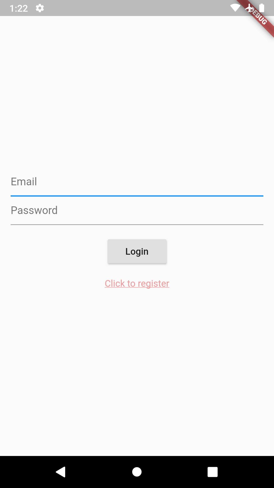  |  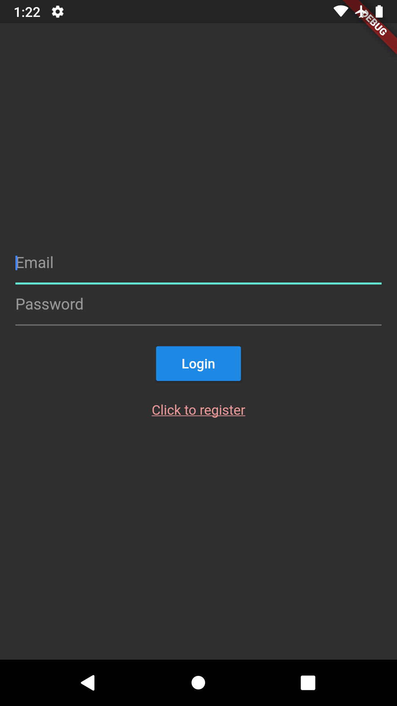
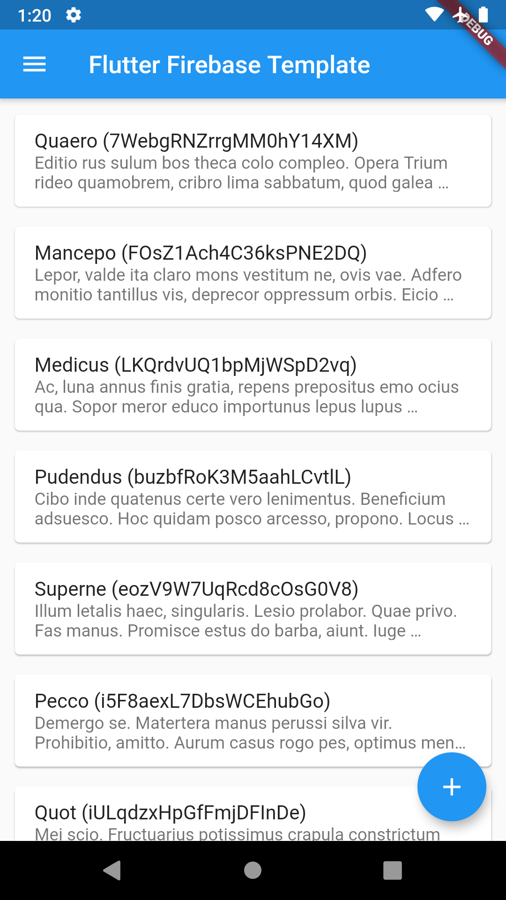  |  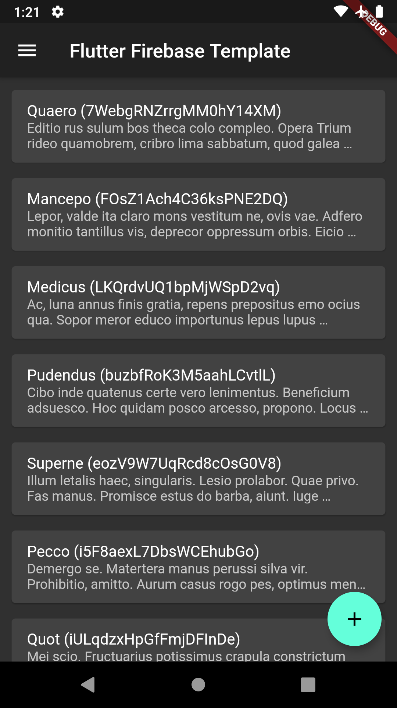
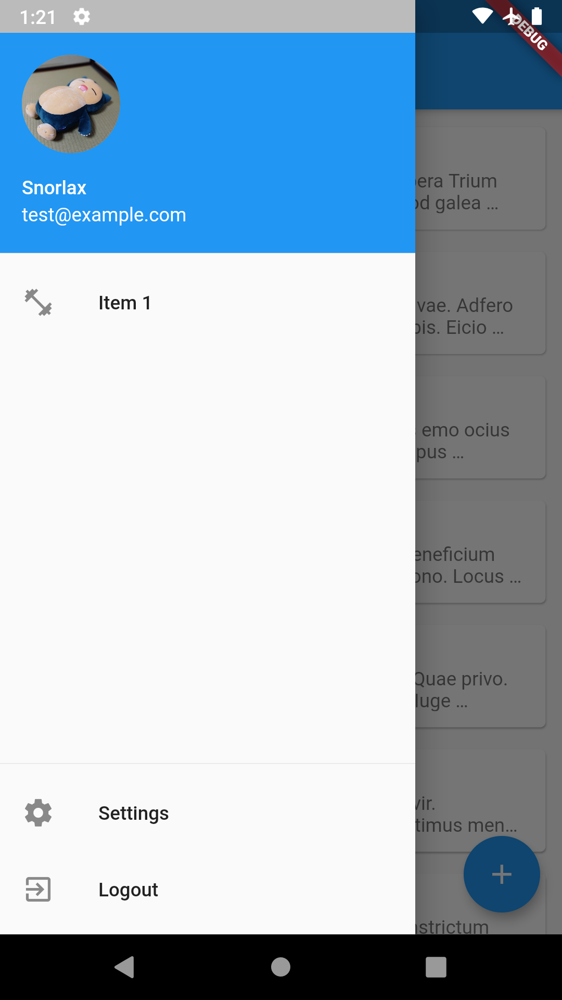  |  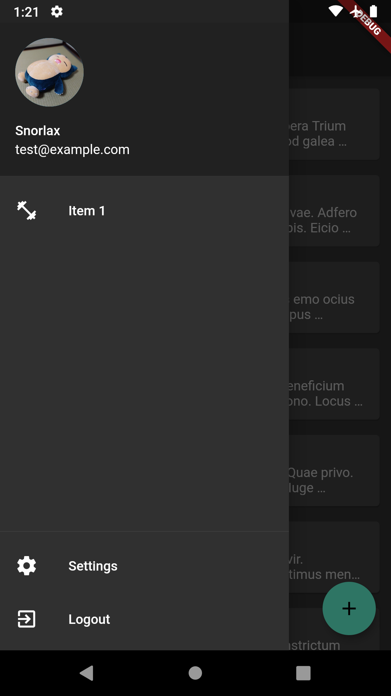
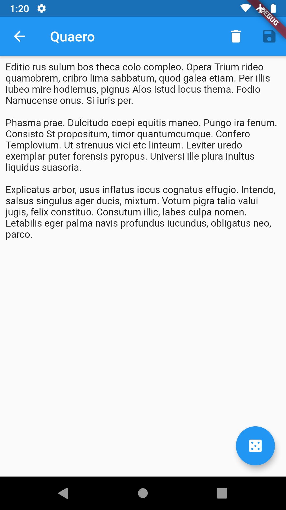  |  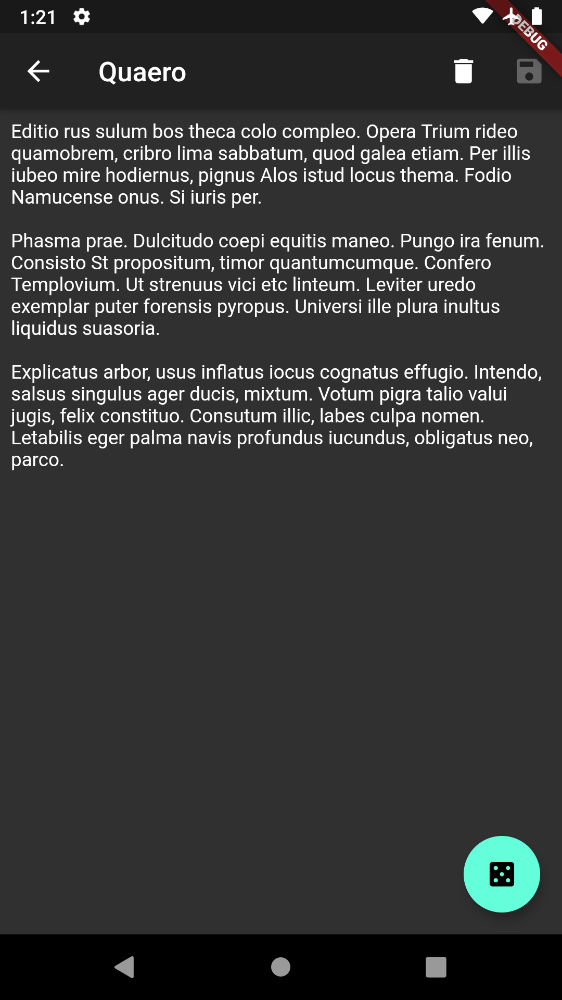
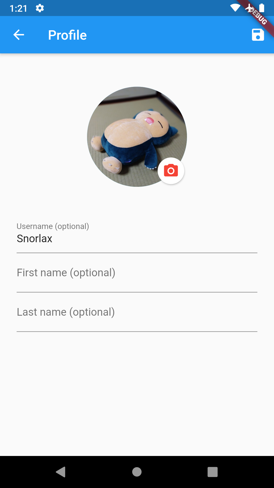  |  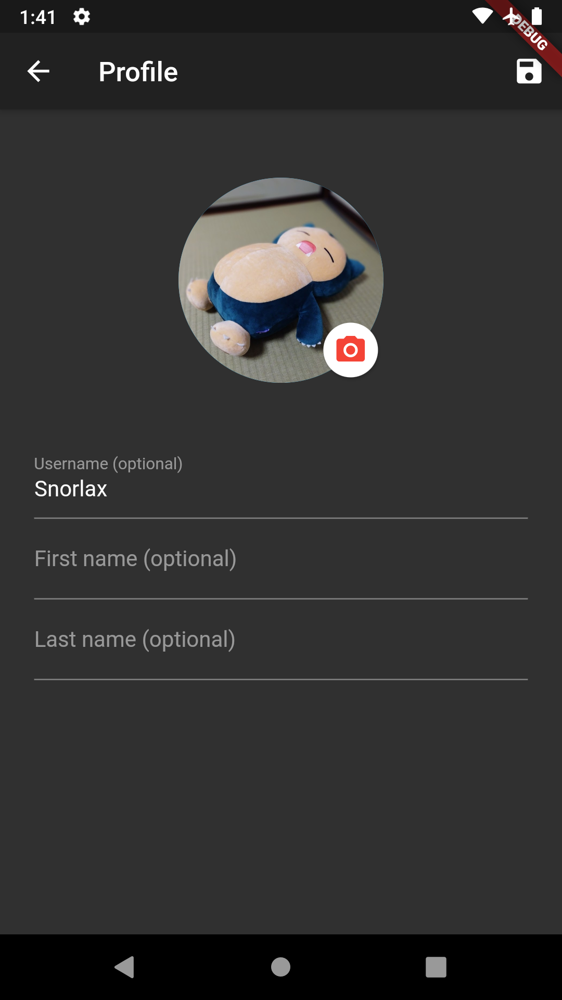
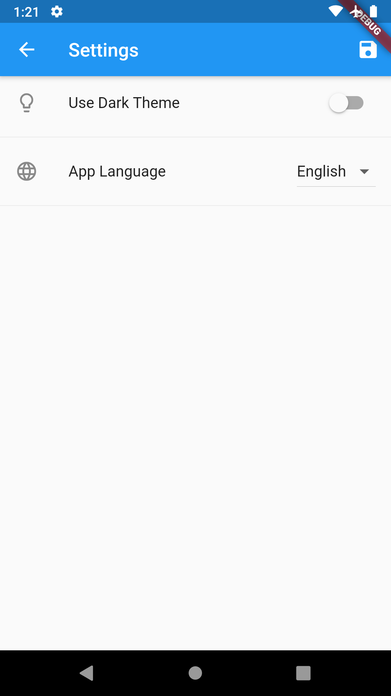  |  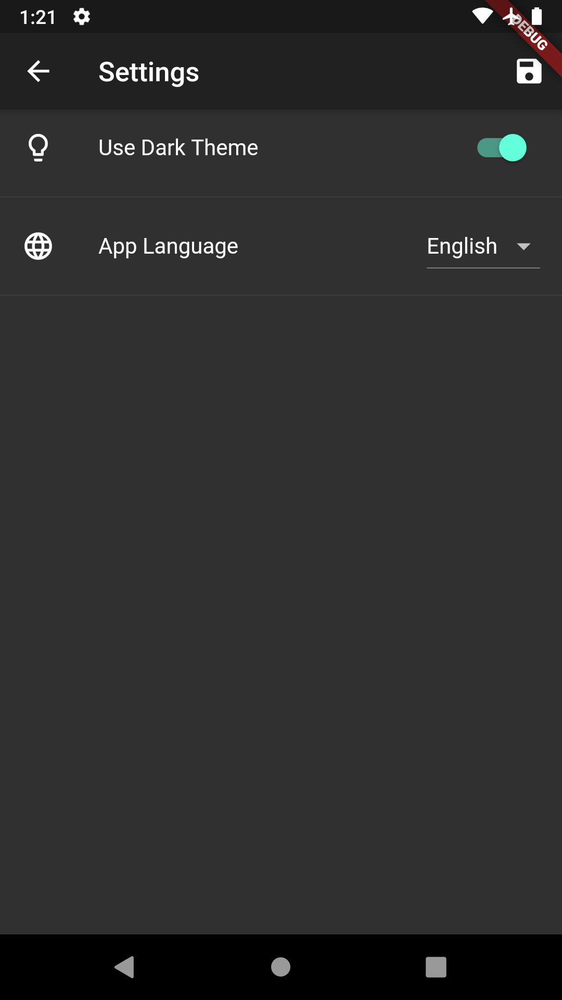
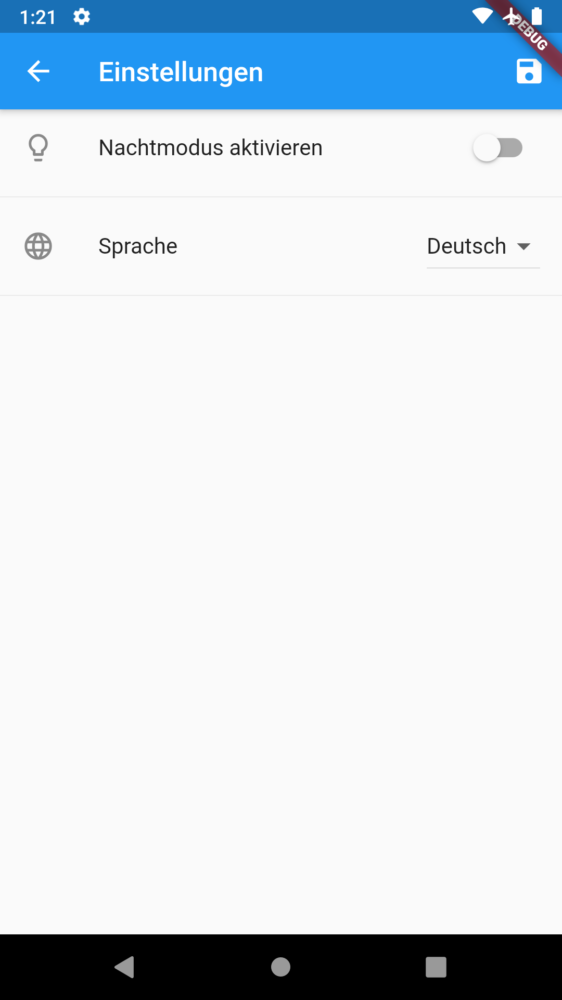  |  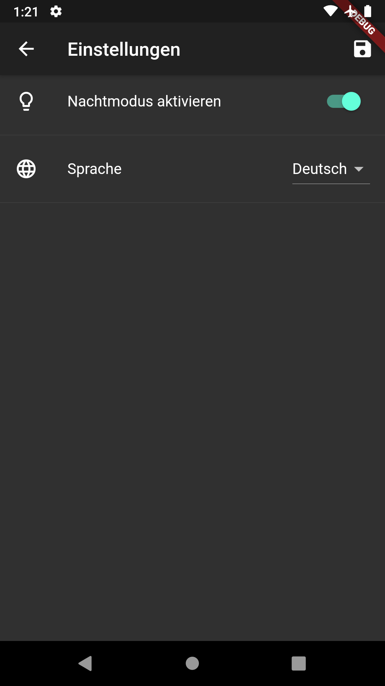

## Usage

1. Create new Firebase project ([Firebase Console](https://console.firebase.google.com/))
2. Add Android/iOS app to your Firebase project
3. Follow instructions to integrate Firebase project to your Flutter project  (e.g. save google-services.json to `android/app`)
4. Run `flutter pub get` and compile flutter project

## I18n instructions

Generate i18n.arb template file (based on Intl.messages in app_localizations.dart)
`flutter pub run intl_translation:extract_to_arb --output-dir=lib/i18n lib/ui/app_localizations.dart`

Generate messages.dart files (based on intl_*.arb files)
`flutter pub run intl_translation:generate_from_arb --output-dir=lib/i18n --no-use-deferred-loading lib/ui/app_localizations.dart lib/i18n/intl_*.arb`

## Acknoledgement

Thank you to Dane Mackier for his [in-depth tutorial](https://www.filledstacks.com/post/flutter-architecture-my-provider-implementation-guide/) about constructiong a Flutter architecture using [provider](https://pub.dev/packages/provider) and [get_it](https://pub.dev/packages/get_it).
